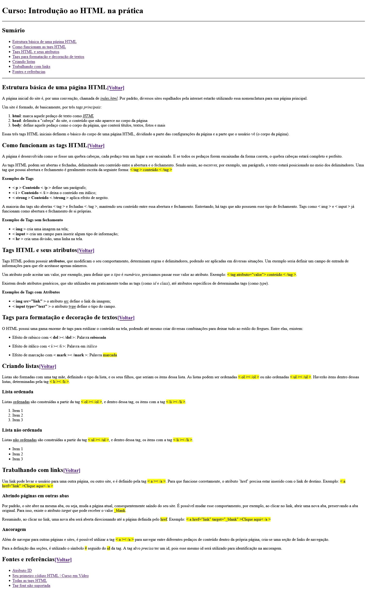

# 📜 Introdução ao HTML na Prática

## 📃 Descrição

Este projeto se trata de um *pequeno e simples site* feito em HTML. O objetivo era fazer um site apenas em HTML e com as tags aprendidas até então no curso **Introdução ao HTML na Prática**, fornecido pela **Digital Innovation One**, fazendo parte do bootcamp **NTT DATA Diversidade em Tech**.

## 🖼️ Imagem do site

Veja como o site ficou, ao vivo, [clicando aqui](https://gracilianoog.github.io/dio-desafio-pagina-html/).

## 📌 Mais informações

Este projeto faz parte da trilha de *HTML* do bootcamp **NTT DATA Diversidade em Tech** da **Digital Innovation One**. O mesmo projeto postado no Github foi entregue, como pedido, na plataforma da *DIO*.

## 🔗 Links

* [🔍 Digital Innovation One](https://www.dio.me/)
* [🔍 Repositório do projeto | DIO](https://github.com/digitalinnovationone/trilha-html-modulo-1)